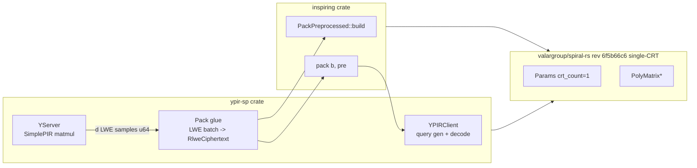

# YPIR-SP on InspiRING — integration plan

A new sibling crate `ypir-sp` inside `/root/inspire` (workspace member alongside [`inspiring`](/root/inspire/inspiring)) implements the YPIR-SP scheme (eprint 2024/270) using [`inspiring::pack`](/root/inspire/inspiring/src/pack.rs) as its sole ring-packing primitive. The `inspiring` crate is consumed as-is (no API surgery) so its SPEC, noise bounds, structural test (`# KS.Switch == d − 1`), and CI continue to apply unchanged.



## Architectural decisions, locked

- **Single workspace, single spiral-rs pin.** `/root/inspire` becomes a Cargo workspace with members `inspiring` and `ypir-sp`. Both share Valar's **`valargroup/spiral-rs` fork at `6f5b66c6a5a639827c6486c59d31c7ec2d4399a8`**, single-CRT (`crt_count == 1`), and the fork's non-AVX-512 path. This sidesteps the impossibility of linking two spiral-rs packages in one binary while keeping the dependency on a maintained fork. We move InspiRING off `menonsamir/spiral-rs` rev `6929441`; see Phase 0 for the cleanup.
- **`inspiring` is not modified.** The integration lives entirely in `ypir-sp`. If a missing primitive surfaces (e.g. a modulus-switch helper), it is added to `ypir-sp`, not punched through `inspiring`. This keeps the `inspiring_vs_cdks_recursion.rs` test honest.
- **YPIR-SP parameter set 2.** Initial target is paper Table 5 row 2 — `(log d, log q, log p, ℓ, z) = (11, 56, 15, 3, 2^19)` — which is the closest match to YPIR-SP's `params_for_scenario_simplepir` (`poly_len = 2048`, `q ≈ 2^56` via `[268369921, 249561089]` 2-CRT, `p = 1<<14`, `t_exp_left = 3`). Single-CRT means we materialise that `q` as one 56-bit prime instead of the two 28-bit primes; the InspiRING SPEC already validates this combination.

## Phase 0 — Repin `inspiring` to Valar's spiral-rs fork

Before any new code is written, flip [`inspiring/Cargo.toml`](/root/inspire/inspiring/Cargo.toml) from `menonsamir/spiral-rs` rev `6929441c6551769b7d099d3af3df347cde3bae7b` to `valargroup/spiral-rs` rev `6f5b66c6a5a639827c6486c59d31c7ec2d4399a8` (package `valar-spiral-rs`, dependency alias `spiral-rs`). Then:

1. **Run `cargo check -p inspiring`** to surface API drift between the two revisions. Likely-affected symbols: `gadget_invert_alloc`, `automorph_alloc`, `to_ntt_alloc` / `from_ntt_alloc`, `stack_ntt`, `multiply`, `DiscreteGaussian::init`, `PolyMatrixRaw::random_rng` / `noise`. Patch each call site in `inspiring/src/` against the new signatures.
2. **Remove the AVX-512 `compile_error!` gate** in [`src/lib.rs`](/root/inspire/inspiring/src/lib.rs) if the fork's scalar path passes the existing regression guard. The gate exists because `arith::multiply_add_modular` at rev `6929441` drops the accumulator on `crt_count == 1`; Valar's fork fixes that path.
3. **Run `cargo test -p inspiring`** at the new pin. All existing tests must pass — `lemma1_trace`, `transform_correctness`, `aggregate_correctness`, `collapse_correctness`, `pack_roundtrip`, `python_oracle_match`, `noise_theorem2`, `offline_online_equivalence`, `parameter_validation`, `inspiring_vs_cdks_recursion`. Any drift here is a Phase 0 blocker, not a Phase 1 problem.
4. **Update [`docs/spiral-rs-mapping.md`](/root/inspire/inspiring/docs/spiral-rs-mapping.md)** — references to the old `menonsamir/spiral-rs` pin and "Require AVX-512 (for now)" need to point at the Valar fork. Re-verify each row of §2's mapping table at the new revision; in particular re-check `gadget::get_bits_per`'s formula since that's the source of the `RlweParams::new` validator's correctness.
5. **Update [`SPEC.md`](/root/inspire/inspiring/SPEC.md)** if it pins a revision (likely yes — paper attribution typically does).

Acceptance: `cargo check -p inspiring` clean, `cargo test -p inspiring` green, docs updated. **No Phase 1 work begins until Phase 0 is green.**

## Phase 1 — Workspace skeleton

Create `/root/inspire/Cargo.toml` (workspace), keeping `inspiring` and adding `ypir-sp`:
- `[workspace] members = ["inspiring", "ypir-sp"]`, `resolver = "2"`.
- `ypir-sp/Cargo.toml`: `inspiring = { path = "../inspiring" }`, plus the YPIR runtime deps at the same versions YPIR uses (`rand`, `rand_chacha`, `log`, `env_logger`, `clap`, `fastrand`, `serde`, `serde_json`, `sha1`). Drop the `actix-*` HTTP-server stack from initial scope to keep the surface small (re-add behind a `http_server` feature once the core is green, if you still want a binary). spiral-rs is **transitive** via `inspiring`; `ypir-sp` does *not* declare its own spiral-rs dep, so there is exactly one resolved fork revision (`6f5b66c6a5a639827c6486c59d31c7ec2d4399a8`) in the workspace.
- `ypir-sp/src/lib.rs` mirrors YPIR's module layout but excludes `packing.rs` (replaced) and `lwe.rs`'s LWE→RLWE bits (delegated to `inspiring::lwe`).
- Reuse `inspiring`'s stable `rust-toolchain.toml`; no `target-cpu=skylake-avx512` override is needed after the Valar fork repin.

## Phase 2 — Parameter mapping

Add `ypir-sp/src/params.rs` with one function:

```rust
pub fn params_for_simplepir(num_items: u64, item_size_bits: u64)
    -> (inspiring::RlweParams, YpirSchemeParams)
```

- `inspiring::RlweParams::new(2048, q_56bit_prime, 1 << 14, 6.4, GadgetParams { bits_per: 19, ell: 3 })`. Pick `q_56bit_prime` so that `q ≡ 1 mod 2d` (NTT-friendly) and `d^{-1} mod q` exists (already validated by `RlweParams::new`).
- `YpirSchemeParams` collects everything that lives outside InspiRING — db dimensions, `q_prime_1`/`q_prime_2` for transport mod-switch, plaintext modulus `p`, item size — i.e. the YPIR-SP-specific knobs in [`ypir/src/params.rs`](/root/ypir/src/params.rs:99). Document the byte-for-byte mapping from the YPIR JSON struct as a docstring on `YpirSchemeParams`.

Output: `cargo test -p ypir-sp params::` round-trips `(num_items, item_size_bits) ↔ (RlweParams, YpirSchemeParams)` and asserts InspiRING's invariants hold.

## Phase 3 — Server: offline precomputation

Port [`server.rs`](/root/ypir/src/server.rs) `perform_offline_precomputation_simplepir` (the SimplePIR hint computation) verbatim — it's u32 arithmetic on the plaintext database, no `crt_count` involvement. Replace the packing-specific tail (`prep_pack_many_lwes`/`generate_fake_pack_pub_params`/`precompute_pack`) with one InspiRING call per RLWE-output index:

```rust
let pre: Vec<PackPreprocessed> = (0..num_rlwe_outputs).map(|i| {
    let crs = build_crs_for_block(&hint_0, i, &params);
    PackPreprocessed::build(&params, &crs, kg.clone(), kh.clone())
}).collect();
```

Where `build_crs_for_block` takes the `i`-th `d`-row block of `hint_0` (which is `poly_len × db_cols`) and stuffs each row into `crs[row, 0]` as a single-element polynomial — i.e. the `a` vectors of the `d` LWE samples that this RLWE output is responsible for, embedded into the CRS shape `[d, 1]` that `PackPreprocessed::build` expects (see [`preprocess.rs:71`](/root/inspire/inspiring/src/preprocess.rs)). The per-block `kg` and `kh` are clones of the single `(K_g, K_h)` pair the client uploaded in the offline phase.

Caching strategy: `PackPreprocessed` already absorbs `transform` + `aggregate` + `τ_g^i(K_g)` images (Phases 5/6/7 of `inspiring`'s plan), so once built, the online `pack` is a pure function of the `b` scalars.

## Phase 4 — Server: online computation

Port `perform_online_computation_simplepir`'s SimplePIR matmul section unchanged (it produces `intermediate: AlignedMemory64<u64>` of length `db_cols`), then:

```rust
let mut packed: Vec<RlweCiphertext> = Vec::with_capacity(num_rlwe_outputs);
for (i, b_block) in intermediate.as_slice().chunks(params.d).enumerate() {
    let batch = LweBatch { inner: lwe_batch_from_b(&hint_0_block(i), b_block) };
    packed.push(inspiring::pack(&batch, &pre[i])?);
}
```

`lwe_batch_from_b` reuses the `a` vectors that fed into preprocessing (so `LweBatch.validate` passes), but at the online site it really only matters that `b_k` is the SimplePIR intermediate. Note: per [`inspiring/src/pack.rs:46-63`](/root/inspire/inspiring/src/pack.rs), only `b` of each `LweCiphertext` is read online; the `a` vectors are ignored. We can therefore feed dummy `a` vectors of the right length and skip carrying the SimplePIR `a`s into the online phase.

Followed by Phase 5's mod-switch + serialization.

## Phase 5 — Mod-switch and decode (single-CRT)

Add `ypir-sp/src/modulus_switch.rs`:
- `pub fn switch_single_crt(ct: &PolyMatrixNTT, q_in: u64, q_out: u64) -> Vec<u64>` — single-CRT analogue of YPIR's [`modulus_switch.rs`](/root/ypir/src/modulus_switch.rs) which currently assumes `crt_count == 2`. Math is identical (`round(c · q_out / q_in)` per coefficient).
- Output bit-packing reuses YPIR's [`bits.rs`](/root/ypir/src/bits.rs) `write_bits` helpers (already CRT-agnostic).

Client-side decode mirrors `decode_response_simplepir_raw` but reads single-CRT bytes. Drop the `params.poly_len` multiplier YPIR applies to `b_values` at [`packing.rs:568`](/root/ypir/src/packing.rs) — InspiRING already absorbs `d⁻¹` inside `intermediate::transform` ([`intermediate.rs:73-83`](/root/inspire/inspiring/src/intermediate.rs)), so applying it again would double-scale. Add a doc-comment with a `// CT-sensitive: see SPEC.md §4` marker on the decode path so the absence of the multiplier is intentional.

## Phase 6 — Client: KS-key generation

Replace [`raw_generate_expansion_params`](/root/ypir/src/client.rs:83) (emits `params.poly_len_log2` matrices) with two `inspiring::key_switching::ks_setup` calls:

```rust
let kg = ks_setup(&params, &tau_g_of_s, &s, rng);
let kh = ks_setup(&params, &tau_h_of_s, &s, rng);
```

`tau_g_of_s` and `tau_h_of_s` use [`inspiring::automorph::tau_ntt`](/root/inspire/inspiring/src/key_switching.rs:179) on the LWE/RLWE secret. Total uploaded key material drops from `log d × ℓ × 2 × d × ⌈log q / 8⌉ ≈ 462 KB` to `2 × ℓ × 2 × d × ⌈log q / 8⌉ ≈ 84 KB` at param set 2 — matches the paper's Table 5.

Add a serialisation helper `ypir-sp/src/serialize.rs::serialize_ks_pair(&kg, &kh) -> Vec<u8>` mirroring `unpack_vec_pm`'s wire format, but for two matrices instead of `log d`. Wire tests assert byte-for-byte stability under a fixed `ChaCha20Rng` seed.

## Phase 7 — Tests

`ypir-sp/tests/`:

1. `pack_replaces_cdks.rs` — set up a 2¹⁴-row, 14-bit-item DB (the `params_for_scenario_simplepir(1 << 14, 16384 * 8)` scenario YPIR's [`scheme.rs:230`](/root/ypir/src/scheme.rs) tests use), perform the full offline+online flow, decrypt, assert the recovered row matches the database row.
2. `linear_cascade_count.rs` — call `inspiring::key_switching::ks_call_count::reset()` then run one online query; assert `ks_call_count::get() == num_rlwe_outputs * (params.d - 1)` (one InspiRING pack per RLWE output, `d − 1` switches each). This is the YPIR-SP-side analogue of `tests/inspiring_vs_cdks_recursion.rs` and is the runtime guard that we are *not* accidentally invoking a CDKS-style fallback.
3. `noise_within_theorem2.rs` — at param set 2, sample 100+ runs, measure `log2(||e_pack||_inf)`, assert below 36 bits (paper measured InspiRING at 33.4, CDKS at 38.5; a value above 36 means CDKS-drift).
4. `mod_switch_roundtrip.rs` — encrypt random plaintext, switch to `(q_prime,)`, switch back, assert under noise budget.

All tests use a deterministic `ChaCha20Rng` seed.

## Phase 8 — Benchmarks

`ypir-sp/benches/end_to_end.rs` (criterion) reproducing YPIR's headline `cargo run --release -- 32768 131072` numbers, plus the `bench/REPORT.md` comparing:

- Offline server time (expect ~2x slower vs YPIR-CDKS — InspiRING's `Stage 1 transform` is per-LWE wider, paper Section 7.4)
- Online server time (expect ~28% faster than YPIR-CDKS at param set 2)
- Offline upload (KS keys): ~84 KB vs 462 KB
- `||e_pack||_inf`: target ≤ 33.4 bits (paper)

If observed online time is *not* lower than YPIR-CDKS, that is a strong signal we left a redundant `pack_lwes_inner_non_recursive`-style operation in the hot path; bench gates this explicitly.

## Phase 9 — Documentation & migration note

- `ypir-sp/README.md`: state the relationship to YPIR (eprint 2024/270) and InspiRING (eprint 2025/1352); link to both papers and to `inspiring`'s SPEC.md.
- A short `MIGRATION.md` listing every YPIR API (`pack_many_lwes`, `pack_pub_params`, `precompute_pack`, …) and its `ypir-sp` replacement, so anyone reading the YPIR repo can find the InspiRING equivalent.

## Risk register

- **Spiral-rs API drift between revisions/forks** (InspiRING was on `menonsamir/spiral-rs` rev `6929441`, both crates now consume Valar's fork rev `6f5b66c6a5a639827c6486c59d31c7ec2d4399a8`). Mitigation: Phase 0 ends with `cargo test -p inspiring` at the new pin — every existing InspiRING test runs against the fork before any Phase 1 code lands. Drift is fixed at Phase 0 and never seen again.
- **`crt_count == 1` performance regression** in spiral-rs's NTT after moving to the non-AVX-512 fork. Mitigation: Phase 8 bench gate; if regression > 30%, file an upstream issue and consider a targeted backend patch.
- **`hint_0` block layout mismatch.** YPIR's `hint_0` is `poly_len × db_cols` row-major u64s; InspiRING's `crs` is a `[d, 1]` `PolyMatrixNTT` whose row `k` is the `k`-th LWE `a` vector. Off-by-one in the row/col extraction is the most likely Phase 3 bug. Mitigation: `tests/pack_replaces_cdks.rs` is the canary; add a focused unit test `crs_block_extraction.rs` that compares InspiRING's `transform(LWE { a })` on extracted blocks against YPIR's `prep_pack_lwes` on the same input.
- **Double-scaling of `b` by `d`.** Both YPIR's `pack_using_precomp_vals` and InspiRING's `transform` apply `d⁻¹`/`d` factors, but at different stages. Phase 5's doc-comment + `pack_replaces_cdks.rs` decryption assertion is the firewall.
- **Loss of YPIR's HTTP server bins.** Out of scope initially; gate behind `feature = "http_server"` once the core is green.

## Acceptance criteria

(a) `cargo test -p ypir-sp` green; (b) `cargo test -p inspiring` green at the Valar fork pin (`6f5b66c6a5a639827c6486c59d31c7ec2d4399a8`) — Phase 0 acceptance; (c) end-to-end test recovers the queried row byte-for-byte under fixed seed; (d) `ks_call_count` test asserts the linear-cascade count exactly; (e) bench numbers within 2x of paper Table 5 row 2.

